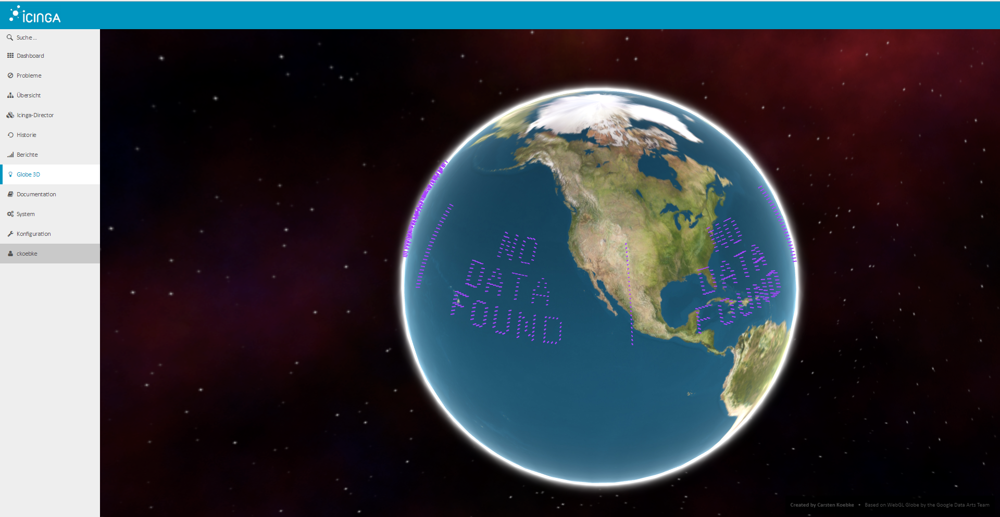

cinga Web 2 Globe 3D Module



## Requirements

* Icinga Web 2 (&gt;= 2.0.0)
* Browser that support WebGL (Firefox,Chrome, etc.)

## Installation

Copy all files/folders into .../icingaweb2/modules/globe. The foldername for the module must be globe!

## Geolocations

To get the hosts displayd on the globe you have to add to each host configuration 
```
var.geolocation = "<latitude>,<longitude>"
```

To get Geolocation data, best use a webiste like http://www.latlong.net or use you smartphone :)
